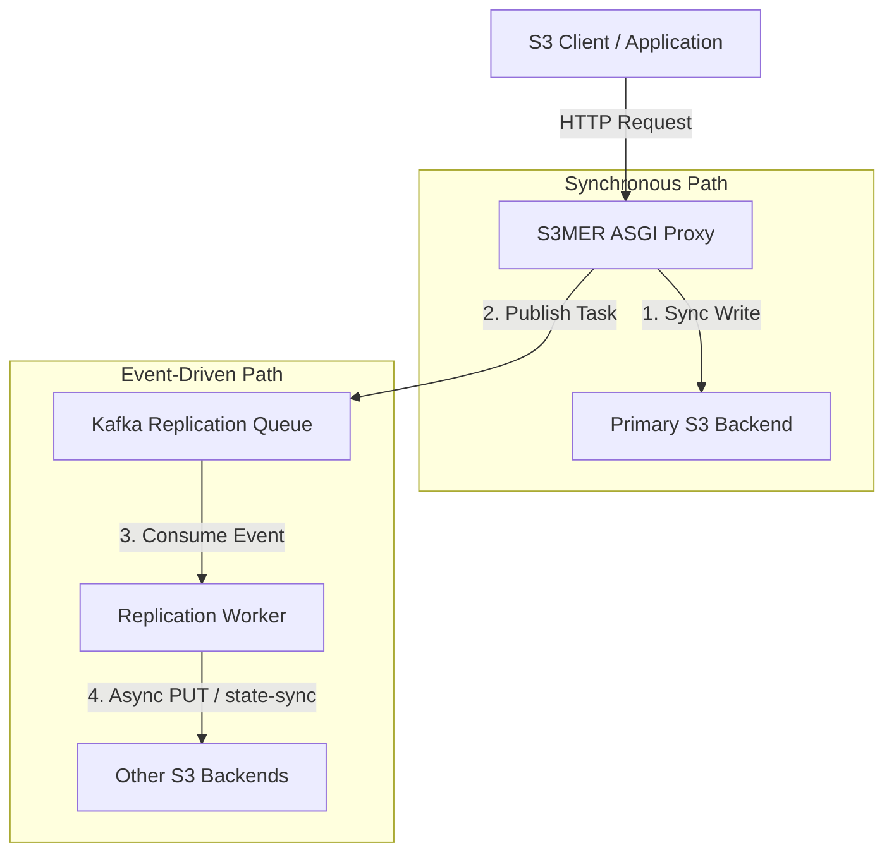

# S3MER: S3 Multi-backend Event-driven Replicator

[](https://www.python.org/)
[](https://opensource.org/licenses/MIT)
[](https://github.com/astral-sh/ruff)
[](https://github.com/astral-sh/ty)

S3MER is an asynchronous S3 proxy that provides **geo-reservation / cross-region durability** when your S3 provider does not offer geo-replication. Writes land on one **primary** region synchronously; other regions are filled asynchronously via Kafka and a background worker (**Zero-Touch** replication).

Cross-region consistency is **eventual**. For deployment assumptions, client retry rules, and contributor guidance, see [AGENTS.md](AGENTS.md). For roadmap priorities, see [TODO.md](TODO.md).

---

## What it is for

| Problem | How S3MER helps |
|--------|------------------|
| Provider has no cross-region replication | Proxy + worker copy objects and bucket metadata to additional S3-compatible backends |
| Need low-latency writes in one region | Primary synchronous write; replication off the hot path |
| Large objects | Streaming `PutObject` / multipart; geo copy after object is complete |

Typical usage: **write once, read a few times**, lifecycle-based expiry (tags/prefixes), optional multipart for large files. Orphaned or incomplete uploads can be handled by your own detection and bucket lifecycle.

---

## Core highlights

- **Pure async ASGI** — path-style S3 proxy (`/bucket/key`) with declarative handler routing.
- **Primary write + Kafka replication** — `WritePrimaryReplicationStrategy` (default); optional `multi_sync` for single-instance synchronous multi-backend writes.
- **Write fallback** — on retryable primary failure, tries other backends; successful backend becomes the replication source.
- **Read fallback** — primary first, then secondaries ordered by latency probing.
- **Zero-Touch worker** — e.g. `CompleteMultipartUpload` / `CopyObject` replicate as `PUT_OBJECT` from the source backend; tagging/lifecycle/policy use state-sync from source.
- **SigV4 chunked uploads** — `aws-chunked` decoded on the fly; bodies spooled to memory/disk only when replay is needed for fallback.
- **Observability** — Prometheus metrics, request IDs, `/.internal/health` and `/.internal/metrics`.
- **Worker resilience** — pause–seek–resume with backoff (no separate DLQ topic).

---

## Architectural flow



---

## Client contract (important)

For writes through the proxy:

1. S3MER writes to the primary (or the next backend on retryable failure), then publishes a replication task to Kafka.
2. If Kafka publish fails, the proxy returns **non-2xx** even if the primary already has the object.
3. The client **must retry** with the **same object key** (`PUT` overwrite is idempotent).
4. Only **2xx** counts as success; retry timeouts and ambiguous responses.

**Multipart:** geo replication runs after successful **`CompleteMultipartUpload`** only. In-flight multipart is **single-backend**—if upload fails mid-session, start a **new** multipart (new `UploadId`) or use `PutObject`; do not expect transparent resume on another backend. Details: [AGENTS.md — Multipart uploads](AGENTS.md#multipart-uploads).

---

## Getting started

### Prerequisites

- **Python 3.12+**
- [**uv**](https://github.com/astral-sh/uv)
- **Docker** and **Docker Compose** (integration tests and local stack)

### Installation

```bash
git clone https://github.com/vargg/s3mer.git
cd s3mer
uv venv
uv sync
cp config/settings.example.yaml config/settings.yaml   # adjust backends and Kafka
```

### Run locally

**1. Dependencies** (MinIO ×2, Kafka, Kafka UI):

```bash
docker compose up -d
```

| Service | URL |
|---------|-----|
| Primary S3 console | http://localhost:9001 (`minioadmin` / `minioadmin`) |
| Secondary S3 console | http://localhost:9003 |
| Kafka UI | http://localhost:8080 |

**2. S3 proxy** (port 8000):

```bash
uv run granian --interface asgi s3mer.app:create_app --factory --host 0.0.0.0 --port 8000
```

Or: `uv run python -m s3mer`

**3. Replication worker:**

```bash
uv run python -m s3mer.worker.app
```
*Alternatively, you can run the worker using the FastStream CLI:*
```bash
uv run faststream run s3mer.worker.app:worker_app
```

Point your S3 client at the proxy endpoint (path-style), using credentials from `config/settings.yaml`.

---

## Configuration

Settings use **Pydantic-settings**: `config/settings.yaml` by default, overridden with `S3MER_` environment variables (nested keys use `__`).

Backends are a **map keyed by name** (not a list), so credentials can be injected per backend from a vault:

```bash
export S3MER_BACKENDS__primary__SECRET_KEY="..."
export S3MER_BACKENDS__primary__ACCESS_KEY="..."
```

See [`config/settings.example.yaml`](config/settings.example.yaml).

| Setting | Default | Description |
|---------|---------|-------------|
| `write_strategy` | `primary_replication` | `primary_replication` or `multi_sync` |
| `replication_mode` | `per_backend` | `per_backend` (recommended) or `batch` |
| `stream_chunk_size` | `65536` | Proxy stream chunk size (bytes) |
| `max_memory_stream_buffer_size` | `10485760` | Spool threshold before disk (bytes) |
| `latency_probe_interval_seconds` | `30` | Backend latency probe interval |

Example file: [`config/settings.example.yaml`](config/settings.example.yaml).

**Geo deployment defaults:** `primary_replication` + `per_backend`. Monitor replication lag and worker retries after successful client writes.

---

## Supported S3 API (summary)

Bucket and object operations including lifecycle, policy, tagging, multipart, and `aws-chunked` `PutObject`. Full list and handler registration notes: [AGENTS.md](AGENTS.md#supported-s3-api-operations).

---

## Development

```bash
make lint        # ruff format, ruff check, ty check
make test-unit   # unit tests
make test        # E2E (Docker Compose)
make clean       # tear down test stack and caches
```

Unit tests only: `uv run pytest tests/unit`

---

## Documentation

| Document | Audience |
|----------|----------|
| [AGENTS.md](AGENTS.md) | Architecture, deployment model, dev rules, API notes |
| [TODO.md](TODO.md) | Roadmap and deferred vs active reliability work |

---

## License

MIT (see repository badge).
