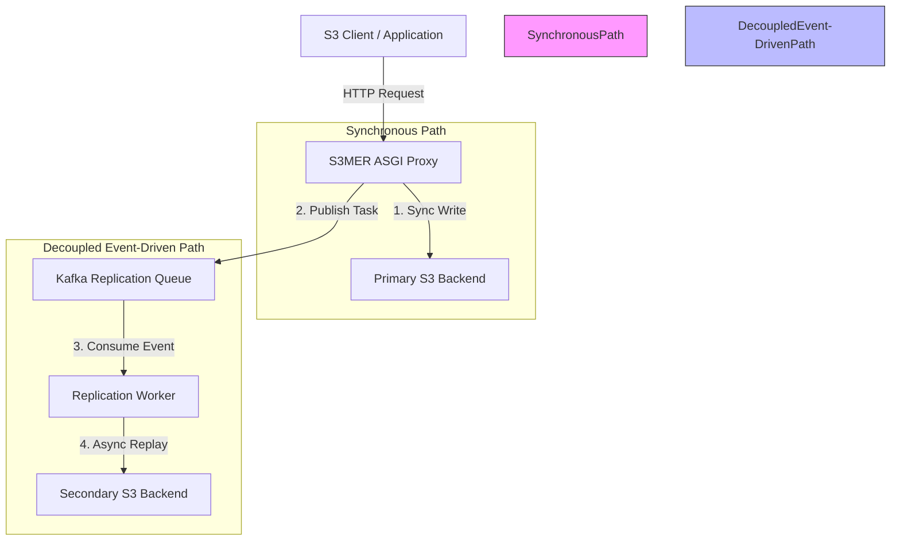

# S3MER: S3 Multi-backend Event-driven Replicator

[](https://www.python.org/)
[](https://opensource.org/licenses/MIT)
[](https://github.com/astral-sh/ruff)
[](https://github.com/astral-sh/ty)

S3MER is a premium, high-performance, asynchronous S3 proxy designed to act as a consistent multi-backend storage bridge. It combines low-overhead, memory-efficient streaming proxying with a "Zero-Touch" background replication architecture driven by Apache Kafka.

---

## ⚡ Core Highlights

- **Pure Async ASGI Architecture**: Built on a modern ASGI stack optimized for high concurrency, low latency, and memory-efficient streaming of huge objects.
- **Zero-Touch Replication**: Offloads high-overhead replication operations to decoupled background workers using Apache Kafka and FastStream, minimizing proxy processing time.
- **Unified Backend Client & Strategies**: Implements cohesive, declarative Execution Strategies for high-availability read failover (read priority fallback) and resilient writes (sync-to-primary with replayable fallbacks).
- **SigV4 Chunked Decoding**: Direct streaming support for `aws-chunked` transfer encodings, allowing large objects to be unwrapped and forwarded on-the-fly without in-memory buffering.
- **Observability Built-in**: Full operational visibility with Prometheus metrics integration (latency, throughput, replication fan-out) and internal operational health endpoints.

---

## 🗺️ Architectural Flow



---

## 🚀 Getting Started

### Prerequisites

Make sure you have the following installed on your system:
- **Python 3.12+**
- [**uv**](https://github.com/astral-sh/uv) (fast Python package installer and resolver)
- **Docker** and **Docker Compose** (for running the integration test environment and backing services)

### Installation

1. Clone this repository and navigate to the root directory:
   ```bash
   git clone https://github.com/vargg/s3mer.git
   cd s3mer
   ```

2. Initialize the virtual environment and install dependencies:
   ```bash
   uv venv
   uv sync
   ```

### Running S3MER

S3MER requires external services (S3 backends and Apache Kafka) to be running before launching the proxy server and the background replication worker.

#### 1. Start External Dependencies (Docker Compose)
We provide a standard `docker-compose.yml` that boots up MinIO for the Primary and Secondary S3 storage, Kafka as the event broker, and a Kafka UI for monitoring:
```bash
docker compose up -d
```
Once started, the following services are available:
- **Primary S3 Console**: [http://localhost:9001](http://localhost:9001) (Credentials: `minioadmin` / `minioadmin`)
- **Secondary S3 Console**: [http://localhost:9003](http://localhost:9003) (Credentials: `minioadmin` / `minioadmin`)
- **Kafka UI**: [http://localhost:8080](http://localhost:8080) (for topic and replication task monitoring)

#### 2. Start the S3 Proxy Server
Launch the main S3 proxy web server running on port `8000`:
```bash
uv run uvicorn s3mer.app:app --host 0.0.0.0 --port 8000
```
The S3 proxy will handle incoming client requests, synchronously write data to the Primary S3 backend, and then publish an asynchronous replication event.

#### 3. Start the Decoupled Replication Worker
Launch the FastStream Kafka consumer to process replication tasks asynchronously in the background:
```bash
uv run python -m s3mer.worker.app
```
*Alternatively, you can run the worker using the FastStream CLI:*
```bash
uv run faststream run s3mer.worker.app:worker_app
```

---

## ⚙️ Configuration

S3MER is configured using robust Pydantic-settings. By default, it loads properties from `config/settings.yaml`. You can override any property using environment variables prefixed with `S3MER_`.

### Example Configuration (`config/settings.example.yaml`)

---

## 🛠️ Development & Quality Gates

S3MER enforces high code quality through rigorous linting, type-safety checks, and comprehensive test suites. All tasks are simplified using the provided `Makefile`.

### 1. Code Formatting & Linting
We use **Ruff** for PEP-8 compliance and imports formatting, and **ty** for strict type checking.
```bash
make lint
```

### 2. Running Unit Tests
Unit tests use mocks and local testing structures to validate dispatcher routing, classifier refinement, strategies, and XML serializers:
```bash
make test-unit
```

### 3. Running E2E Integration Suite
The E2E test suite boots up active S3 backends (MinIO) and Kafka brokers inside Docker containers to test the complete event-driven proxy and background replication flow:
```bash
make test
```

### 4. Cleanup the Test Environment
Shutdown running docker compose services and purge test caches:
```bash
make clean
```

---

## 🗺️ Roadmap & Operational Goals

For planned enhancements and architectural reliability milestones (like the Transactional Outbox/Write-Ahead Log, Active Anti-Entropy Reconciliation, Health Probing, and Versioning support), please refer to [TODO.md](file:///Users/username/dev/s3m/TODO.md).
